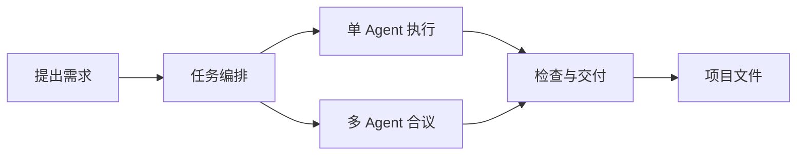
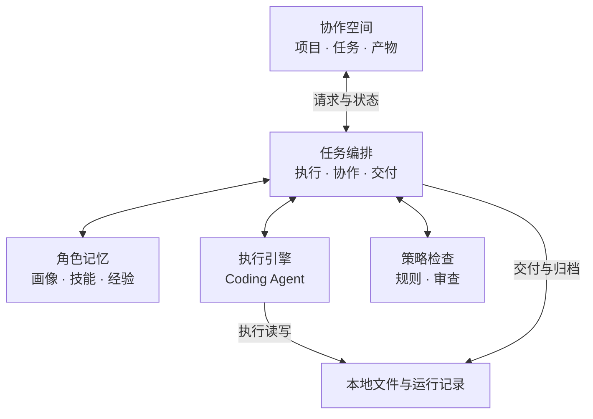

# Polaris

**面向软件开发的智能协作空间。**

组织 Agent 协作，将需求转化为本地项目中的代码与文件。

## 协作逻辑



单 Agent 直接执行；多 Agent 通过提案、评审与综合完成协作。进度、角色记忆与交付文件集中在同一个项目中。

## 功能与架构

| 功能     | 可以做什么                                           |
| -------- | ---------------------------------------------------- |
| 任务协作 | 选择执行模式，按角色配置驱动，跟踪任务与续跑         |
| 过程观测 | 查看阶段进度、工具活动、事件和 token 用量            |
| 角色记忆 | 管理 Agent 画像、技能、经验与技能市场                |
| 项目交付 | 浏览交付文件、恢复历史任务，使用 Python 终端运行脚本 |



内置 Claude Code 与本地记忆存储。可在「设置 → 驱动路由」中为角色选择执行器；其他执行器需要单独安装并配置。

## 开始使用

### 安装版

从 [Releases](https://github.com/polaris-pku/Polaris/releases) 下载已发布的平台安装包。
安装包包含后端与 Claude Code，无需另外安装 Node.js 或开发工具。没有对应平台安装包时，可从源码启动。

1. **配置模型**：打开「设置 → 模型与认证」，选择服务商并填写 API Key；自定义服务还需填写端点和模型，然后「保存并重启后端」。
2. **选择项目**：在首页新建项目，或通过「打开项目 → 从文件夹打开」选择已有目录。
3. **提交需求**：点击「新建需求」，填写需求与验收标准，选择「单 Agent」或「多 Agent 合议」。
4. **查看交付**：在运行页查看进度与用量，在项目文件树查看产物；运行 Python 脚本前，先在「运行时」中选择或安装解释器。

支持 Anthropic 官方 API、DeepSeek 和自定义 Anthropic 兼容端点。

> Agent 会执行命令并修改文件，所需的项目内容会发送给你选择的模型服务。请在有版本控制的项目中使用；Polaris 不是系统沙箱。

### 从源码启动

需要 **Node.js 22.22.1+**（见 [.nvmrc](.nvmrc)）与 **pnpm**（版本见 [package.json](package.json) 的 `packageManager`）。

```bash
git clone https://github.com/polaris-pku/Polaris.git
cd Polaris
corepack enable
pnpm install
pnpm build:backend
pnpm electron:dev
```

首次构建后端会下载执行器运行时；修改后端代码后需重新运行 `pnpm build:backend`。
Linux / WSL 需要可用的图形环境及 Electron 系统依赖。启动后按上面的步骤配置模型和项目。

## 深入了解

[使用指南](src/docs/overview.md) · [运行参考](src/docs/protocol.md) · [Python 终端](src/docs/python-terminal.md) · [开发与贡献](CONTRIBUTING.md)
